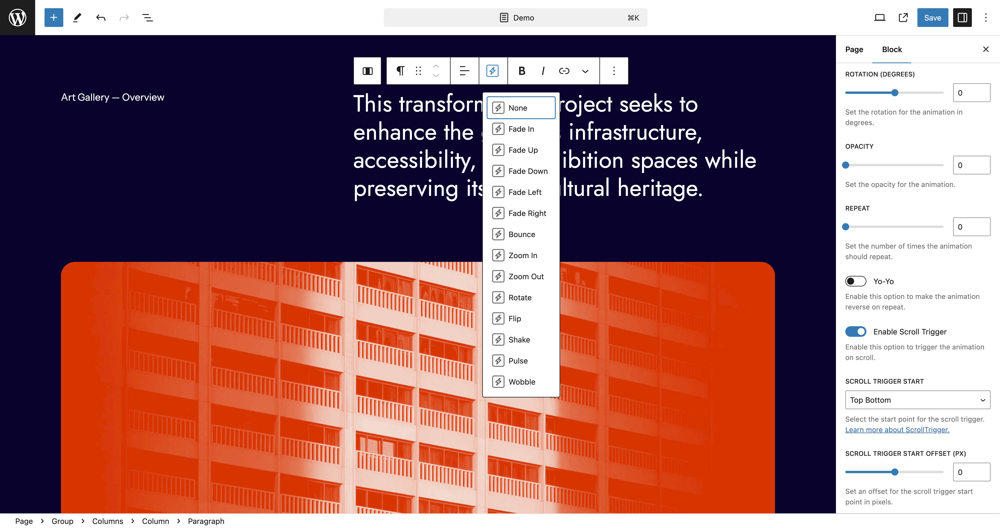

# Prolific Animations

Prolific Animations is a game-changer for WordPress sites, empowering site creators, maintainers, designers, and content authors to effortlessly add captivating animations to any block or section. Designed for modern WordPress themes that leverage the block editor, this plugin transforms static content into dynamic, engaging experiences that captivate and retain visitors. Whether you're looking to enhance user interaction, emphasize important content, or simply add visual flair, Prolific Animations provides the tools you need to create stunning animations with ease.

## Features

- **Compatibility**: Works seamlessly with core blocks, third-party blocks, and custom blocks.
- **Advanced Controls**: Full access to detailed animation settings for precise customization.
- **Presets**: Select from a variety of presets to quickly apply animations.
- **Customizable**: Tailor presets or create custom animations to fit your unique needs.
- **Triggers**: Control exactly when animations occur, including scroll triggers.

## Installation

1. Upload the plugin files to the `/wp-content/plugins/prolific-animations` directory, or install the plugin through the WordPress plugins screen directly.
2. Activate the plugin through the 'Plugins' screen in WordPress.

## Usage

Once the Prolific Animations plugin is activated, you'll find new animation options available for every block within the block editor.

### Adding an Animation

1. Select the block you wish to animate.
2. In the block toolbar, click on the animations icon.
3. Choose a preset animation type from the dropdown menu. You can select from options such as Fade In, Fade Up, Fade Down, Fade Left, Fade Right, Bounce, Zoom In, Zoom Out, Rotate, Flip, Shake, Pulse, and Wobble.

### Preset Options

To quickly get started with animations, choose a preset from the available list in the block toolbar. Presets will auto-configure the advanced settings, allowing you to see how the animation options change. You can further refine these settings to meet your needs.

1. **Fade In**
2. **Fade Up**
3. **Fade Down**
4. **Fade Left**
5. **Fade Right**
6. **Bounce**
7. **Zoom In**
8. **Zoom Out**
9. **Rotate**
10. **Flip**
11. **Shake**
12. **Pulse**
13. **Wobble**

### Advanced Animation Settings

Customize your animations with the following options:

1. **Enable Animation**: Toggle this option to enable the animation.
2. **Loop**: Enable this option to loop the animation.
3. **Auto Play**: Enable this option to auto-play the animation.
4. **Animation Duration**: Set the duration of the animation in seconds.
5. **Animation Delay**: Set the delay before the animation starts in seconds.
6. **Animation Easing**: Choose the easing function for the animation.
7. **X Position (PX)**: Set the X position for the animation in pixels.
8. **Y Position (PX)**: Set the Y position for the animation in pixels.
9. **X Percent (%)**: Set the X position as a percentage for the animation.
10. **Y Percent (%)**: Set the Y position as a percentage for the animation.
11. **Scale**: Set the scale for the animation.
12. **Rotation (Degrees)**: Set the rotation for the animation in degrees.
13. **Opacity**: Set the opacity for the animation.
14. **Repeat**: Set the number of times the animation should repeat.
15. **Yo-Yo**: Enable this option to make the animation reverse on repeat.
16. **Enable Scroll Trigger**: Enable this option to trigger the animation on scroll.
17. **Scroll Trigger Start**: Select the start point for the scroll trigger.
18. **Scroll Trigger Start Offset (PX)**: Set an offset for the scroll trigger start point in pixels.

### Understanding Animation "From"

The animations in Prolific Animations work by animating the block "from" a specified state to its final state. This means that you define where the animation starts, and the block transitions from that state to its natural position and appearance.

#### Example: Fade In from Left

To create a "Fade In from Left" animation:

1. **Enable Animation**: Toggle this option to enable the animation.
2. **Animation Type**: Select "Fade In".
3. **X Position (PX)**: Set the X position to -100 (or any negative value) to start the block to the left.
4. **Animation Duration**: Set the duration to 1 second (or any preferred duration).
5. **Animation Easing**: Choose an easing function, such as "Power1.inOut".

This setup will make the block start 100 pixels to the left of its natural position and fade in while moving to its final position over the course of 1 second.

## Support

For further assistance, contact [support@prolificdigital.com](mailto:support@prolificdigital.com).

---

Prolific Animations is a powerful tool that brings your WordPress site to life with engaging and customizable animations. Whether you're looking to enhance user interaction or add visual flair to your content, Prolific Animations provides the flexibility and control you need.

Happy animating!
